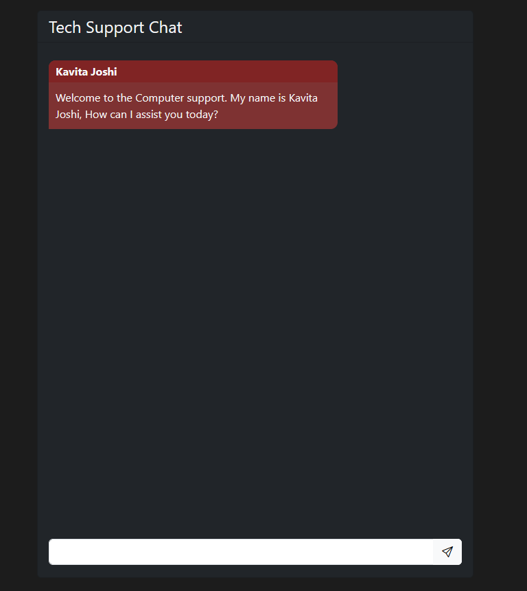
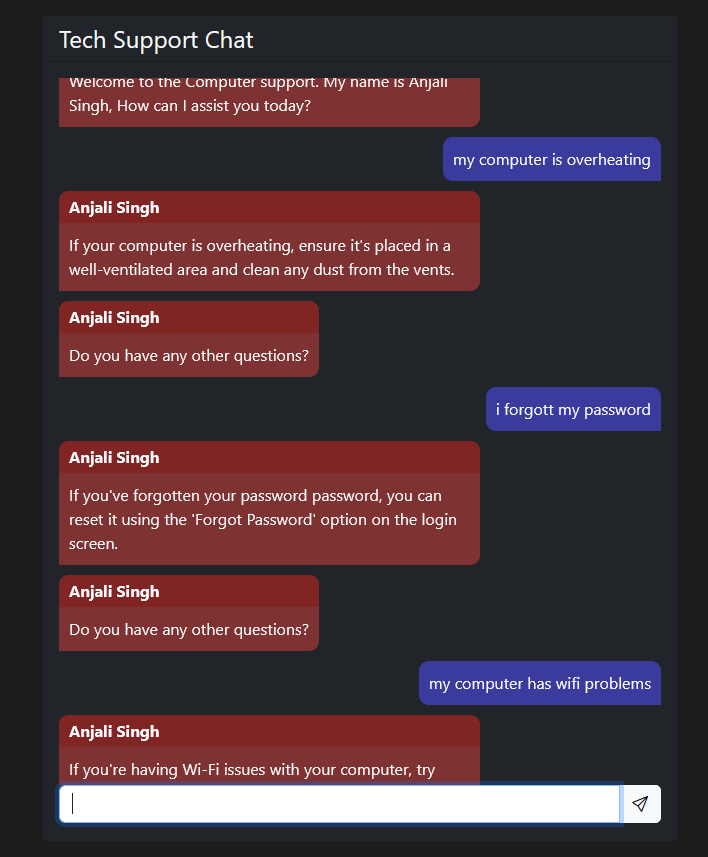
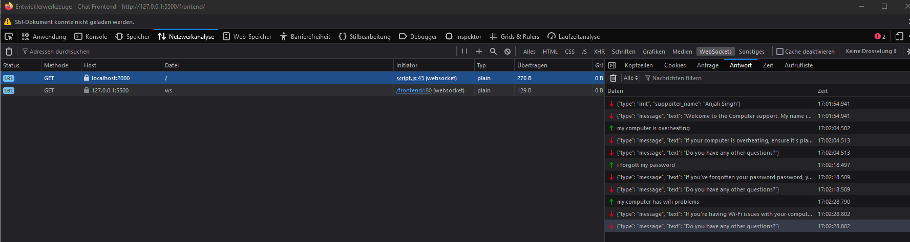
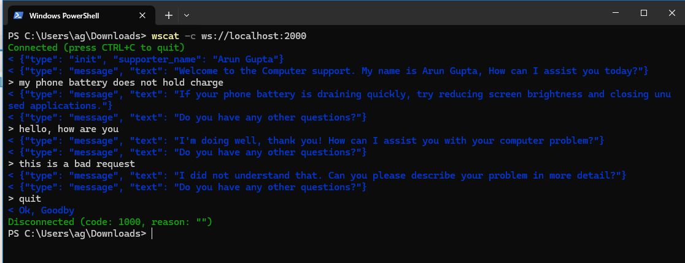

# Python Tech Support CHATBOT

## Author
Aaron Gensetter

## Overview
For this Tech Support Chatbot i made a retrieval based method. I decided on the Domain Tech Support.

## Use Cases
- **Customer Support:** Providing quick responses to common customer queries.

## Techniques Used
- **Natural Language Processing (NLP):** For understanding and processing user inputs.
- **Contextual Embeddings:** For better understanding the context of user queries.

## Backend
### Dependencies / Libraries
| Library    | Description                              |
|------------|------------------------------------------|
| Python 3.8+| Programming language                     |
| asyncio    | Asynchronous programming in Python       |
| websockets | Enabling communication over TCP Socket   |
| random     | Selecting random elements                |
| json       | Handling JSON data          |
| spacy      | Natural Language Processing toolkit      |
| re         | Regular expressions for pattern matching |
| nltk       | Natural Language Toolkit for NLP         |

## Frontend

The Frontend starts a websocket connection to the backend (chatbot).
The first thing the chatbot sends is a "init" message with some information (currently just the supporter_name (this will be random select of names)) this message will not be displayed to the user. After thet there is a greeting. then the user can ask questions that will be answered.

### Dependencies / Libraries
| Technology   | Description                             |
|--------------|-----------------------------------------|
| HTML         | Markup language for structuring content |
| CSS          | Style sheet language for designing      |
| Bootstrap CSS| CSS framework for responsive design     |
| JavaScript   | Scripting language for dynamic content  |
| Websockets   | Protocol for real-time communication    |

# Screenshots
Basic chat layout on https://ip_to_frontend:2000

Some Chats

This is the websocket traffic for this chat:

You can also use a tool like wscat if you fancy to

# Reflection
// TODO: